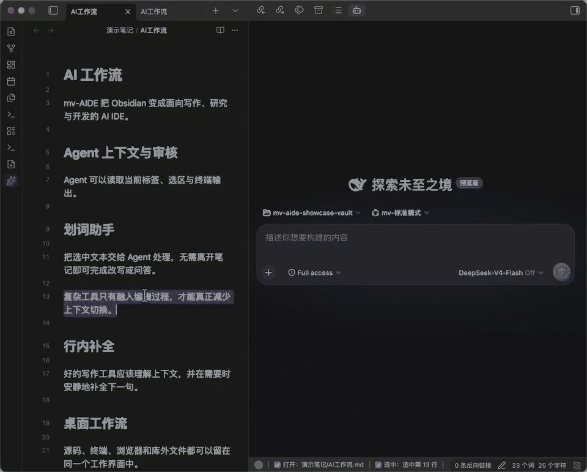

# mv-AIDE

[English](README_EN.md) | [完整功能手册](docs/features.md)

**把 Obsidian 变成面向写作、研究与开发的 AI IDE。** mv-AIDE 让 Agent 感知你正在阅读和编辑的内容，并把 AI 编辑、源码工具、终端、Vim 与桌面文件工作流放进同一个界面。

> 仅支持桌面端，要求 Obsidian 1.7.2 及以上。

[GitHub 仓库](https://github.com/aitingtingya/mv-obcc)


## 为什么是 mv-AIDE

### Agent 不再脱离现场

Claude Code、Codex CLI 和任意 MCP Agent 可以读取当前标签、选区、诊断、终端输出和笔记关系。Agent 提出的修改回到 Obsidian 中，以可编辑 Diff 交给你确认。

### AI 是编辑器的一部分

「文件内AI助手」统一收纳 API 提供商、划词助手和行内补全。划词助手负责明确的局部任务，行内补全安静地延续当前文字；两者共用提供商，但开关和运行周期仍彼此独立。

### 从文字到源码与桌面工作流

同一插件内可以编辑 TeX 等源码、运行终端、使用独立 Vim 引擎、浏览电脑文件，并让库外文件由指定 Obsidian 仓库打开。每个模块都能单独关闭。

## 九个设置分区

以下顺序与 **设置 → mv-AIDE** 一致。具体默认值、平台边界和排障见[完整功能手册](docs/features.md)。

### 1. IDE 桥接

当前文件、选区和编辑器状态会被动同步给 Agent：选中文字后直接提问即可，不需要先要求 Agent 调用工具读取现场。支持 Claude Code、Codex CLI、通用 MCP 客户端和 DeepSeek Harness（DSH）。开启「启用 dsh IDE 功能」后，DSH 内的 mv-AIDE 插件经同一本地桥接获得现场上下文、IDE 工具、被动通知与 Diff 审核。


[查看 IDE 桥接边界](docs/features.md#ide-bridge)

### 2. mv-agent

> [!NOTE] 维护说明
> 最近科研上事情比较多，DSH 频繁的破坏性更新无法保证 mv-agent 可以适配所有版本。如果遇到问题可以提交 issue，并开启「IDE 桥接」后使用 DSH 的官方 UI 感知 Obsidian。

mv-agent 把 DSH Web 界面直接放进 Obsidian。视图底部状态栏显示真实桥接状态、当前页面或文件、选区、端口和可展开的现场详情；命令面板提供「打开 / 停止 / 重启 mv-agent」。

设置页按 Node.js、DSH、pnpm、插件注入四层检测环境，可安装到当前 Vault 或全局位置，也能识别、验证并管理 DeepSeek Harness 源码仓库。注入后 DSH 获得 `/mv-aide` 命令和 `mv_aide__*` IDE 工具，并支持：

- 每个 DSH 对话独立选择、记忆和恢复 Vault；
- 用 Obsidian 可编辑 Diff 审核需要权限的文件写入；
- 把 Vault 内或电脑上的文件、文件夹直接拖进对话：图片作为附件，普通文件作为实时 `@file` 引用，文件夹作为 DSH 原生目录引用；
- 七个可选终端增强工具，包括可靠命令执行和关闭真实终端标签；
- 上传前图片缩放，以及模型图片输入、思考等级和兼容参数设置；
- 默认关闭、可按通道开放的库外工具与被动上下文。

mv-AIDE 完整注入会管理 mv-agent、mv-dsh-manager 和独立的 mv-dsh-subworkspace 三个 DSH 插件。DSH 原生「插件配置」中显示三者的配置卡；子工作区还可从工作区行内管理，不依赖 IDE 桥接。文件拖入与 IDE 桥接也保持独立，桥接关闭时仍可向当前 DSH 草稿添加本机文件。

三个 DSH 插件共用内部兼容库 `@mv-aide/mv-dsh-compat`，以同时保持 DSH 预览版的既有行为并适配 Alpha 接口。该库不是第四个 DSH 插件，不增加设置卡或独立运行状态；未识别的接口只会关闭对应增强，不影响 DSH 和其他功能。

需要 Web 鉴权的 DSH 会把登录 Cookie 交给系统安全存储加密，仅用于重开 Obsidian 后接回同一个本机实例；启动 URL 中的 token 不落盘。系统安全存储不可用或登录态失效时，mv-agent 会要求重新授权，不会另起同数据目录的后台争抢会话。

注入的 DSH 插件支持自动更新对齐到当前 mv-AIDE 版本（默认关闭），可选地在更新完成后自动重启 mv-agent；Obsidian 原生状态栏可在 mv-agent 分区一键隐藏。



[查看 mv-agent 说明](docs/features.md#mv-agent)

### 3. 文件内AI助手

展开后依次是「API提供商」、「划词助手」、「行内补全」三个默认折叠的子区。展开状态只在当前设置页会话中记忆，不会新增持久化设置。

#### API提供商

统一管理 OpenAI-compatible 或 Anthropic 类型的端点、密钥和模型，供两个助手共用。

#### 划词助手

在 Markdown、PDF 或网页中选中文字，调用自己的提示词模板，流式结果可以继续编辑、插入或替换原文。网页视图（Web Viewer）受跨域隔离，可开启注入式右键菜单（实验性）；关闭时插件会把已绑定的「LLM: xxx」快捷键同步注入网页。下面是在英文 PDF 中划词并用 DeepSeek 翻译。


[查看划词助手设置](docs/features.md#selection-assistant)

#### 行内补全

在 Markdown 中输入时生成灰色 ghost text，用 Tab 接受后才写入正文，也可以取消、拒绝并请求另一版。


[查看行内补全参数](docs/features.md#inline-completion)

### 4. 终端

在 Obsidian 的主栏、侧栏或底部分栏运行真实系统终端，让命令行和编辑器保持在同一个工作区。终端设置把“打开位置”和“新终端打开方式（分屏 / 新建标签页）”分开控制。`mv-run: <命令>` 会发送到最近活跃的 mv-AIDE 终端（没有时自动新建），`mv-run -n: <命令>` 则始终新建终端执行。开启 mv-agent 的「终端感知增强」后，DSH 还能按终端 ID 读取、输入、运行命令、聚焦或关闭标签。


[查看终端支持范围](docs/features.md#terminal)

**mv-run 顺序执行**：在命令面板选择「运行 mv-run 指令」，直接回车按文件顺序执行未受保护的命令；也可选「指定执行」，输入 `pdf,@refs -p,pdf`。文件内支持 `--name` 命名、`--group` 分组和 `--protect` 默认跳过；每一步真正结束后才执行下一步，失败即停止。[语法与示例](docs/features.md#mv-run)

### 5. 源码编写辅助

按后缀注册非 Markdown 源码，配置高亮、Lint、正则替换、`mv-run`、Code Suite 和可选 TeX 数学增强。Markdown 视图顶部状态栏也可在此分区一键设为自动收起。


[查看源码 profile 与 Code Suite](docs/features.md#source-assist)

### 6. Vim 增强

独立实现的 Vim 编辑核心支持主要模式、motion、operator、text object、寄存器、宏、搜索、Ex 命令和仓库级 `.vimrc`。隐藏 Obsidian 原生状态栏时，Vim 模式徽章自动切换为编辑器内悬浮显示。

支持 `clipboard=unnamed,unnamedplus` 双向系统剪贴板、Unicode 字符边界、次数重复和常用 Vim 搜索语法；不是完整 Vimscript 或第三方 Vim 插件运行环境。具体支持边界见能力清单。


**图例：** `NORMAL` 中以 motion 移动；`VISUAL` 中选区与光标同步；`INSERT` 中输入正文。左侧行号演示 `.vimrc` 的 `number` + `relativenumber`。

[查看 Vim 能力清单](docs/features.md#vim)

### 7. 默认文件打开器

把 Markdown、PDF 及选定源码后缀交给指定 Obsidian 仓库。即使 Obsidian 已关闭，双击库外文件也能唤醒目标仓库并打开它；Windows 上的库外 PDF 会使用短生命周期镜像，关闭最后一个对应标签后自动清理。


[查看平台限制与数据模型](docs/features.md#default-opener)

### 8. 文件系统与浏览器

从 Obsidian 直接浏览任意目录、打开下载文件，并给内置网页浏览器补充下载与历史入口。三个独立的「自动收起」开关可分别精简网页顶栏、Markdown 顶栏与标签页栏；**自定义网页按钮**把常用网址注册成 Ribbon 图标或命令面板命令，在左 / 中 / 右任一区域一键用内置浏览器打开。


[查看文件路由规则](docs/features.md#filesystem-browser)

### 9. Git

调用本机安装的 Git 管理当前 Vault 所属仓库，不内置 Git 引擎，不自动提交、同步或联网。工作区面板（暂存区／工作区／未跟踪／冲突分组、提交拓扑图、分支／标签／stash 引用区）与命令面板共用同一套动作注册表，逐项双端可达；diff 视图支持并排／行内布局、行／差异块级暂存与可编辑的工作区一侧；三方冲突编辑器按真实来源标注（rebase 时 ours/theirs 语义正确互换）。也可以把当前 Vault 原地初始化为仓库，再配置远程并完成首次推送。

[查看 Git 能力表与边界](docs/features.md#git)

## 安装

### 社区插件市场

1. 打开 **设置 → 第三方插件 → 社区插件 → 浏览**。
2. 搜索 `mv-AIDE`，安装并启用。

<details>
<summary>手动安装</summary>

从 [Releases](https://github.com/aitingtingya/mv-obcc/releases) 下载 `main.js`、`manifest.json`、`styles.css`，放入：

```text
<vault>/.obsidian/plugins/mv-obcc/
```

然后在 **设置 → 第三方插件** 中启用 mv-AIDE。

</details>

<details>
<summary>从源码构建</summary>

```bash
npm install
npm run verify
npm run deploy:local
```

`npm run package` 会在 `release/` 中生成发布产物。

</details>

## 数据与权限

- IDE 桥接、通用 MCP 和默认打开器服务只监听 `127.0.0.1`。
- API Key 以明文保存在当前仓库插件目录的 `data.json` 中；请保护仓库及其备份。
- Vim 配置、库外文件镜像和其它仓库级数据位于当前仓库的 `mv-aide/`；跨进程状态位于 `~/.mv-aide/`，其中 IDE discovery 在 `ide/`、dsh bridge selection 在 `dsh/`，默认打开器的当前 authority 为 `file-opener/`（升级时保留失败安全的 legacy 兼容）。
- mv-agent 的环境安装只在用户点击对应按钮后联网。仓库安装的 Node.js、DSH 和 pnpm 运行时位于 `<vault>/mv-aide/dsh/`，可在设置中独立选择 `<vault>/mv-aide/dsh/home` 作为 DSH 数据目录；该选择不改变 DSH 是仓库安装、全局安装还是源码目录。关闭时保持 DSH 官方 `$DSH_HOME` / `~/.dsh` 行为。三个独立管理的 DSH 插件及其内部兼容库位于当前选中的 DSH web profile；mv-AIDE 启动的进程还会在同一 `DSH_HOME/.mv-aide/runtime-owners/` 下写入不含密钥的 PID/端口/身份指纹，仅用于防止误接管或停止另一个 DSH。兼容库无 Cordis 入口、无单独 patch row，不会作为第四个插件加载。下载、npm 缓存和安装脚本仅使用临时工作区并在操作结束后删除。选择全局安装或原位升级时，插件会显示系统管理员授权，不会静默改装到仓库。
- Windows 默认应用必须由用户在系统设置中确认；插件只写当前用户注册表，不申请管理员权限，也不修改受保护的 `UserChoice`。
- 各模块都有独立开关。所有后缀都关闭 Vim 后，Vim 运行模块、监听器与编辑器扩展不会加载。

完整说明见[数据与网络边界](docs/features.md#storage-network)和[平台支持矩阵](docs/features.md#platform-matrix)。

## 文档

- [完整功能手册（中文）](docs/features.md)
- [Complete Feature Guide (English)](docs/features-en.md)
- [第三方声明](THIRD_PARTY_NOTICES.md)
- [许可证](LICENSE)

## 致谢

行内补全的 CodeMirror 架构参考了 [obsidian-github-copilot](https://github.com/Pierrad/obsidian-github-copilot) 的公开思路；终端进程桥接参考了 [obsidian-claude-sidebar](https://github.com/derek-larson14/obsidian-claude-sidebar) 的公开设计。Source Assist 的 Code Suite 内核基于 [obsidian-latex-suite](https://github.com/artisticat1/obsidian-latex-suite) `1.11.5`，保留 MIT 声明。Vim 的兼容目标与配置体验参考了 [obsidian-vimrc-support](https://github.com/esm7/obsidian-vimrc-support) 和 [Vim Motions](https://github.com/saberzero1/motions) 的公开文档与用户可见思路，核心引擎依据 Vim/Neovim 行为和 CodeMirror 6 API 独立实现。

Git 集成的命令设计与测试思路参考了 [Obsidian Git](https://github.com/Vinzent03/obsidian-git)（MIT），提交节点／分支／标签／stash 的菜单组织参考了 [VS Code 内置 Git 扩展](https://github.com/microsoft/vscode/blob/main/extensions/git/package.json)（MIT）的公开菜单定义；两者的功能缺口均不继承。Git 前端为独立实现，未复制两者源码，底层始终调用本机 Git。

DSH 兼容层的 adapter/capability 边界参考了 [dsh-std](https://github.com/Yan-Zero/dsh-std) 的公开思路，版本矩阵与 conformance 门禁参考了 [dsh-ecosystem-spec](https://github.com/T-Auto/dsh-ecosystem-spec) 的公开思路。mv-AIDE 的适配层为独立实现，未复制两者源码、不引入其运行时依赖，也不声明通过任何第三方规范认证。

详见[第三方声明](THIRD_PARTY_NOTICES.md)与[许可证](LICENSE)。
