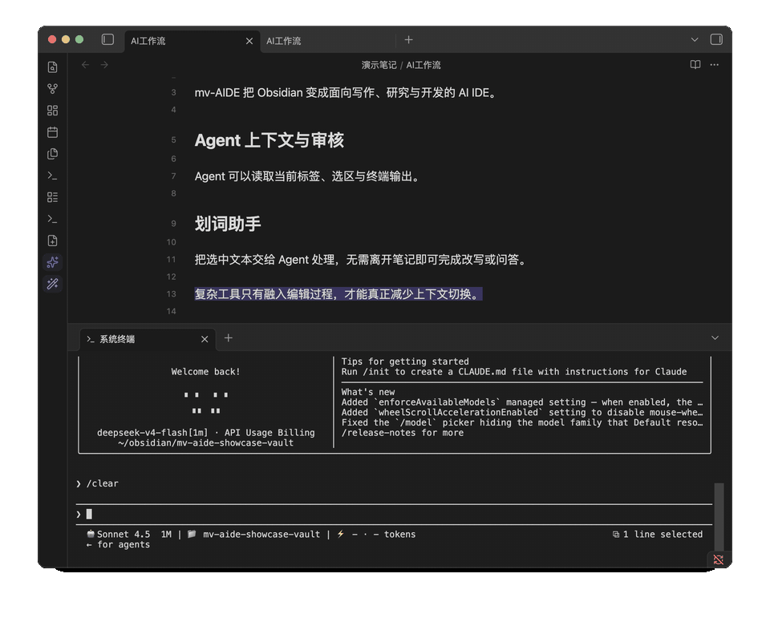
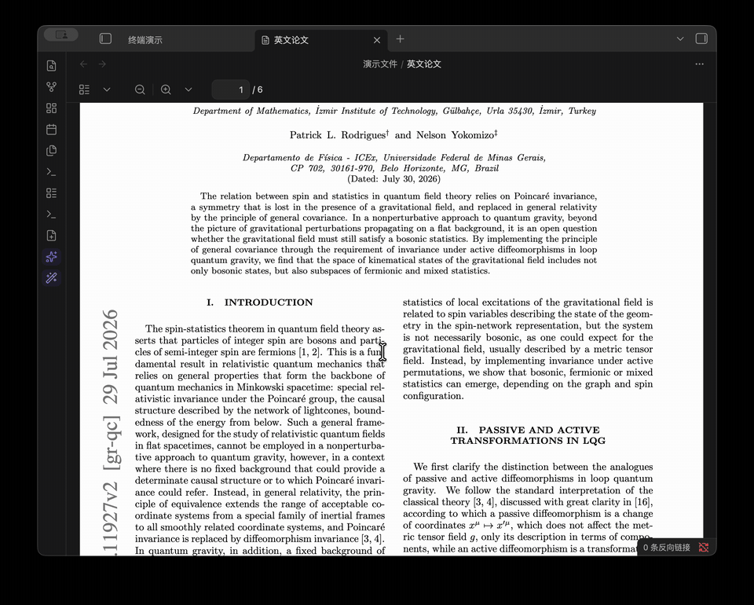
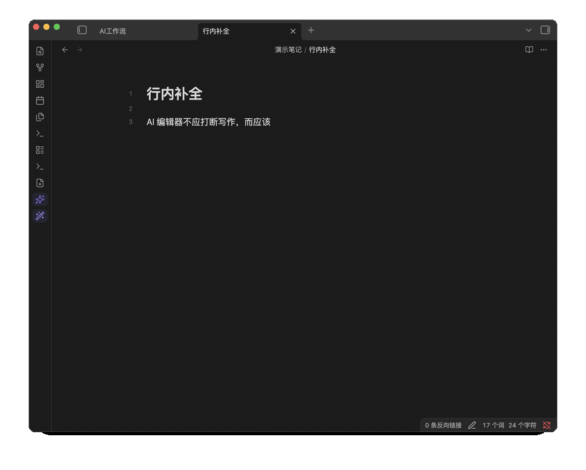
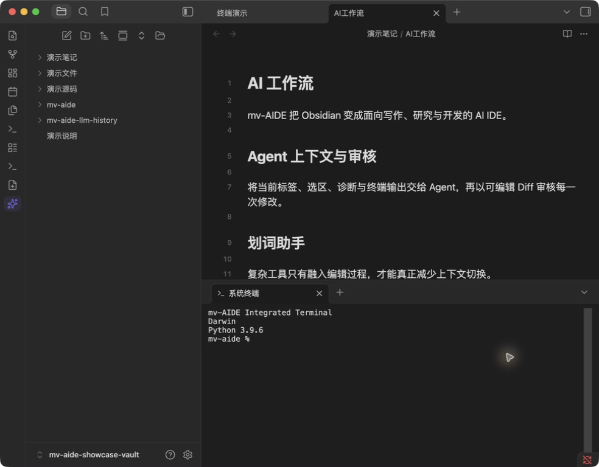
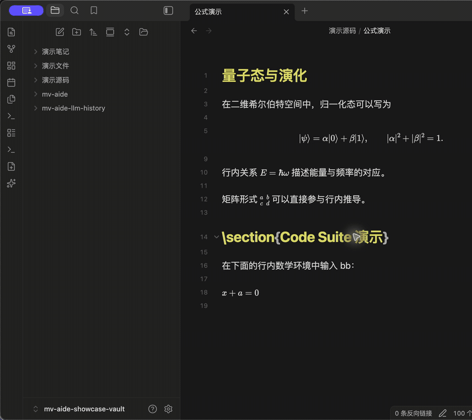
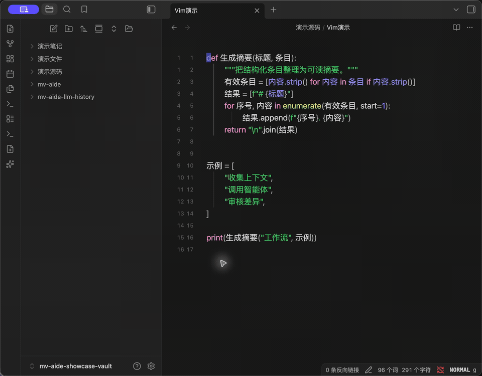
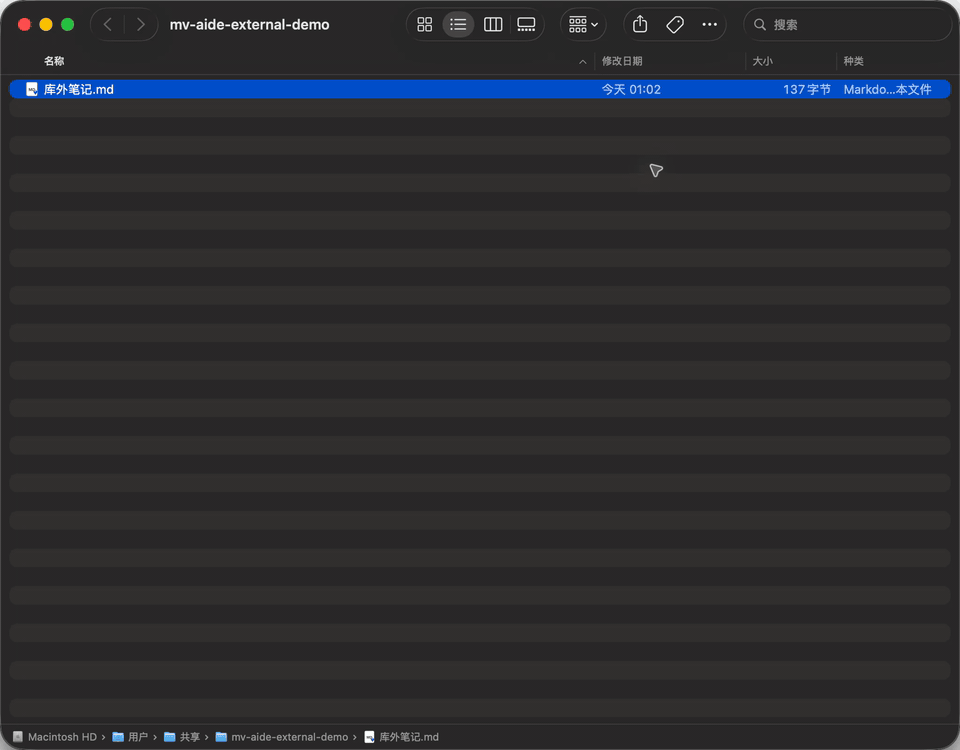
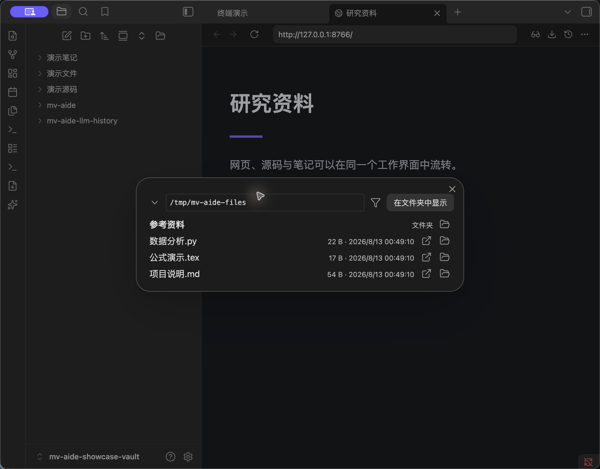

# mv-AIDE

[中文](README.md) | [Complete feature guide](docs/features-en.md)

**Turn Obsidian into an AI IDE for writing, research, and development.** mv-AIDE gives agents access to the material you are actively reading and editing, then brings AI editing, source tools, a terminal, Vim, and desktop file workflows into one interface.

> Desktop only. Requires Obsidian 1.7.2 or later.

[GitHub repository](https://github.com/aitingtingya/mv-obcc)



## Why mv-AIDE

### Agents stay in context

Claude Code, Codex CLI, and any MCP agent can read active tabs, selections, diagnostics, terminal output, and note relationships. Proposed edits return to Obsidian as an editable diff for review.

### AI becomes part of the editor

Selection Assistant handles explicit local tasks while Inline Completion quietly continues the text at the cursor. Both use configurable OpenAI-compatible or Anthropic providers, with separate switches and deterministic input priority.

### One workflow from prose to source code and desktop files

Edit TeX and other source types, run a real terminal, use an independent Vim engine, browse the filesystem, and open external files in a chosen Obsidian vault. Every module can be disabled independently.

## Eight Workflows

The order below matches **Settings → mv-AIDE**. See the [complete feature guide](docs/features-en.md) for settings, defaults, platform boundaries, and troubleshooting.

### 1. IDE Bridge

The active file, selection, and editor state are passively synchronized with the agent. Select text and ask naturally; there is no preliminary instruction to call a context-reading tool. Claude Code, Codex CLI, and general MCP clients are supported. The demo runs Claude Code inside mv-AIDE's terminal, where it automatically receives the Obsidian selection and answers directly.


[IDE Bridge details](docs/features-en.md#ide-bridge)

### 2. Selection Assistant

Select text in Markdown, PDF, or Web Viewer, invoke a prompt template, then edit, insert, or replace from the streamed result. The demo translates a selection from an English PDF through DeepSeek.



[Selection Assistant settings](docs/features-en.md#selection-assistant)

### 3. Inline Completion

Generate dimmed ghost text while writing Markdown. It enters the document only after Tab acceptance; it can also be canceled or rejected to request another version.



[Inline Completion parameters](docs/features-en.md#inline-completion)

### 4. Terminal

Run a real system terminal in the main area, a sidebar, or a bottom split, keeping the command line and editor in one workspace.



[Terminal support](docs/features-en.md#terminal)

### 5. Source Assist

Register non-Markdown source extensions and configure highlighting, linting, regex replacement, `mv-run`, Code Suite, and optional enhanced TeX math rendering.



[Source profiles and Code Suite](docs/features-en.md#source-assist)

### 6. Vim Enhancement

The independently implemented Vim core supports the major modes, motions, operators, text objects, registers, macros, search, Ex commands, and a vault-level `.vimrc`.



**Legend:** use motions in `NORMAL`, move the live selection and cursor together in `VISUAL`, and enter text in `INSERT`. The gutter demonstrates `.vimrc` `number` + `relativenumber`.

[Vim capability reference](docs/features-en.md#vim)

### 7. Default File Opener

Route Markdown and selected source extensions to a specific Obsidian vault. Double-clicking an external file can wake Obsidian and open the target vault even when it was closed.



[Platform limits and data model](docs/features-en.md#default-opener)

### 8. Filesystem & Browser

Browse arbitrary directories, open downloaded files, and add Downloads and History entry points to Obsidian's built-in Web Viewer.



[File routing rules](docs/features-en.md#filesystem-browser)

## Installation

### Community Plugins

1. Open **Settings → Community plugins → Browse**.
2. Search for `mv-AIDE`, then install and enable it.

<details>
<summary>Manual installation</summary>

Download `main.js`, `manifest.json`, and `styles.css` from [Releases](https://github.com/aitingtingya/mv-obcc/releases), then place them in:

```text
<vault>/.obsidian/plugins/mv-obcc/
```

Enable mv-AIDE under **Settings → Community plugins**.

</details>

<details>
<summary>Build from source</summary>

```bash
npm install
npm run verify
npm run deploy:local
```

`npm run package` creates release artifacts under `release/`.

</details>

## Data & Permissions

- The IDE bridge, universal MCP endpoint, and default-opener service listen on `127.0.0.1` only.
- API keys are stored as plain text in `data.json` inside the current vault's plugin directory. Protect the vault and its backups accordingly.
- Vim configuration, external-file mirrors, and other vault-level data live under `mv-aide/` in the current vault. System registration data for the default-opener wrapper is the only runtime data allowed in the user directory.
- Windows default-app confirmation must be completed by the user. The plugin writes only to the current user's registry, requests no administrator privileges, and never modifies the protected `UserChoice`.
- Modules have independent switches. When Vim is disabled for every extension, its runtime, listeners, and editor extensions are not loaded.

See [Data and network boundaries](docs/features-en.md#storage-network) and the [platform matrix](docs/features-en.md#platform-matrix) for details.

## Documentation

- [Complete Feature Guide](docs/features-en.md)
- [完整功能手册](docs/features.md)
- [Windows Validation](WINDOWS-VALIDATION.md)
- [Vim implementation and provenance](docs/vim-engine-provenance.md)
- [Third-party notices](THIRD_PARTY_NOTICES.md)
- [License](LICENSE)

## Acknowledgements

The CodeMirror architecture of Inline Completion was informed by the public design of [obsidian-github-copilot](https://github.com/Pierrad/obsidian-github-copilot), and the terminal process bridge by [obsidian-claude-sidebar](https://github.com/derek-larson14/obsidian-claude-sidebar). Source Assist's Code Suite kernel is based on [obsidian-latex-suite](https://github.com/artisticat1/obsidian-latex-suite) `1.11.5` with its MIT notice preserved. Vim compatibility targets and configuration UX were informed by the public documentation and user-visible ideas of [obsidian-vimrc-support](https://github.com/esm7/obsidian-vimrc-support) and [Vim Motions](https://github.com/saberzero1/motions); mv-AIDE's core engine is independently implemented against Vim/Neovim behavior and CodeMirror 6 APIs.

See [Third-party notices](THIRD_PARTY_NOTICES.md) and [Vim provenance](docs/vim-engine-provenance.md) for the exact boundaries.
